# Computer-Vision - Completed

## Part 5: Final Update 

How to run code (at bottom of this part write-up, also will be at Tues OH to display code)

Slideshow: [https://docs.google.com/presentation/d/1Ku1Y4pHpqf_nqaaH8u0-EfxcCPXUWM5D8AGYuw7_ifw/edit#slide=id.p  
](https://docs.google.com/presentation/d/1Ku1Y4pHpqf_nqaaH8u0-EfxcCPXUWM5D8AGYuw7_ifw/edit?usp=sharing)

## Description of the Test Database
The test database was collected during the validation and training phases. It consists of images that were randomly assigned to different folders, ensuring that the test images were not used for training or validation. While the database shares some similarities with the training and validation subsets, such as a consistent background (a table), it introduces variability through random positioning of the cards and occasional blurry images. This setup simulates how the program is expected to operate in real-world scenarios, where cards are placed on a table with slight variations in position, angle and clarity.
The decision to use this setup is rooted in practicality: the program is designed specifically to identify cards on a table, not in complex environments or with additional backgrounds. Therefore, adding unnecessary complexity, such as cards in outdoor scenes or highly cluttered backgrounds, would not align with the intended use case and could detract from the testing process. The test set is sufficient because it mimics real-world use cases of card identification on a table.
Classification Accuracy on different test sets
### **Train Set Performance**
 - **Precision:** 22.57% 
- **Recall:** 33.33% 
- **F1-Score:** 25.56% 
- **Accuracy:** 46.61% 
### **Validation Set Performance**
 - **Precision:** 9.99% 
- **Recall:** 17.65%
 - **F1-Score:** 11.72% 
- **Accuracy:** 45.24% 
### **Test Set Performance** 
- **Precision:** 15.44% 
- **Recall:** 25.84%
 - **F1-Score:** 16.58%
 - **Accuracy:** 44.53%

## Analysis of Results 
### Train vs. Validation Performance 
- The training set shows higher precision, recall, and F1-score compared to the validation set, indicating some degree of overfitting.
 - The precision drop in the validation set highlights the model's struggle to generalize beyond the training data.
 ### Validation vs. Test Performance
 - The test set results show slight improvement over the validation set, suggesting that the model benefits from being tested on unseen data with similar characteristics. 
### Overall Model Performance 
- The model's accuracy on the test set is 44.53%, which is consistent with the validation set's accuracy (45.24%). -
- Low recall across all subsets indicates the model's challenge in detecting a significant portion of positive samples. 
- Improving precision and recall and overall sample size could lead to better overall performance.
Performance on the Test Set
As expected, the performance on the test set was worse than that observed on the training and validation sets. Several factors contributed to the lower accuracy:

## Misidentification During Cropping:

In some cases, the card was incorrectly cropped, leaving portions of the card out of the frame. This led to the model detecting objects that were not part of the card itself, such as areas between the card's edge and the cropped image's boundary.
This issue highlights the need for a more robust cropping mechanism to ensure the entire card is captured within the frame.
Challenges with Identifying the Center and Bounding Boxes:
Misidentification of the card's center led to errors in classifying values and suits. For instance, the suit, which is closer to the card's center, was sometimes confused with the value due to errors in calculating the Euclidean distance from the center.
Bounding boxes occasionally extended outside the card’s edges, resulting in inaccurate classifications.
Blurry or Poor-Quality Images:
Some test images were blurry, making it challenging for the model to accurately detect and classify the card's features. Blurry edges or faint markings further reduced the confidence of predictions.
Snapshot Identification Limitations:
During real-time testing, the live feed faced difficulties in identifying features in the middle of the card or distinguishing the suit from the value. These issues were amplified by slight variations in lighting and positioning.

For example:
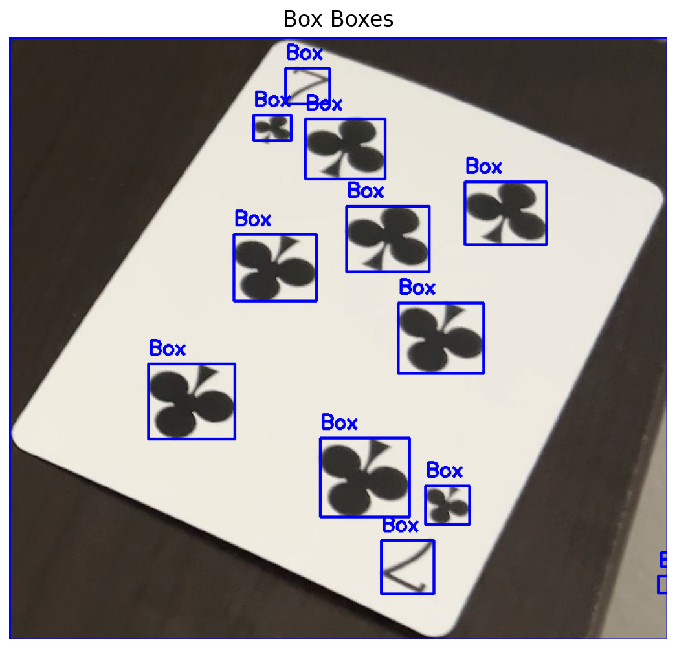

This bounding box of the card still gets boxes outside of the card edge. Look at the blue box in the bottom right. Although this example will remove that because there's no equodistance opposite value (because there's a card top and bottom the code will work with other values before deciding), I'm sure some test images will misclassify these outer edges.

Another example 

This bouding box is close to finding the exact heart value execpt the code thinks that heart is the one that signifies the value. Getting that portion of the leaf because it's the wrong hear will hurt the data later on. 

## Proposed Improvements
To address the observed challenges and reduce error rates, the following improvements are recommended:
Enhanced Cropping and Bounding Box Detection:
Implement stricter criteria to ensure all bounding boxes are confined to the card itself. This could involve additional pre-processing steps to filter out noise or regions outside the card's borders.
Refinement of Suit and Value Classification:
Introduce additional validation checks to distinguish between suits and values more effectively. For instance, combining distance-based classification with proximity to known regions of interest (e.g., the edges for values and the center for suits) could improve accuracy.
Improved Handling of Blurry Images:
Augment the training dataset with synthetically blurred images to make the model more robust to poor-quality inputs. Alternatively, pre-processing techniques like deblurring or edge enhancement could be applied to the test images.
Live Feed Optimization:
Allow for more flexibility in snapshot timing to ensure clear and stable frames. Adding functionality to confirm a selected region before processing could also reduce errors during real-time testing.
Iterative Testing and Fine-Tuning:
Iteratively test and refine the cropping, bounding box detection, and classification logic. Incorporating additional feedback loops to validate bounding boxes before classification would help reduce false positives.

## Individual Contributions
This project was completed independently. All stages, including dataset collection, model training, evaluation, and implementation of the live feed, were carried out by me. The solo nature of this effort ensured a comprehensive understanding of all aspects of the project, from data pre-processing to final evaluation and optimization.

## Final Deliverables: Instructions for Running the Code ##
Below are the instructions to run the various scripts included in this repository. The final solution has been designed to be runnable out of the box with minimal setup. Before running the code, please ensure that all necessary dependencies and imports are installed in your environment. These dependencies could not be uploaded to GitHub due to their size, so make sure to configure your environment accordingly with the proper imports.
Additionally, ensure that all required files (e.g., dataset, ssd_card_model.pth) are placed in the correct locations as specified in the scripts exactly how this folder is already set up. 

## 1. Preprocessing with Visualizations ## 
To visualize how a card is processed (cropping, bounding boxes, etc.), run:

- python testing_for_visuals.py

  
This script demonstrates the full breakdown of card processing, including cropping, bounding boxes, and the identification of the middle, suit, and value. It is useful for debugging or understanding the preprocessing steps.
Sample output is shown in part 3. (Each bounding box of the image will be produced)

## 2. Preprocessing without Visualizations ##

For large-scale processing of multiple cards, use:
- python SSDtesting.py

  
This script applies the same preprocessing logic as testing_for_visuals.py but without visualizations. To enable visualizations, uncomment line 300. However, testing_for_visuals.py already shows everything needed for individual card processing.

## 3. Training the Model ##
To train the SSD model, generate bounding boxes, and create the ssd_card_model.pth file:
- python training.py

Trains the SSD model for 40 epochs.
Processes the cards using SSDtesting.py to generate bounding boxes and identify card values/suits.
Saves the trained model to ssd_card_model.pth.
Sameple output: 

Loaded 492 images.
Epoch [1/40], Loss: 77.87779752219596

(Until epochs are finished)

## 4. Evaluating Model Performance ##
To generate prediction statistics on the testing, validation, or training datasets, run:
- python testing.py

  
Adjust the dataset being evaluated by modifying line 31 (photos/test, photos/train, or photos/validation).
Outputs metrics such as precision, recall, F1-score, and accuracy.
Example output:

Precision: 0.1544 

Recall: 0.2584

F1-Score: 0.1658

Accuracy: 44.5281

## 5. Real-Time Card Detection ##
To test the program in real-time using a webcam feed, run:
- python live_card.py

Press spacebar to capture a snapshot from the live feed.
The snapshot is processed through cropping and the model's prediction pipeline.
Predictions are displayed on the screen, including the card value and suit, along with a confidence score.
Notes:
Requires the same color background for more accurate edge detection.
Works best when cards are positioned neatly on a flat surface.
Prediction skews towards lower value cards

## Sample Test Image

Original Image: 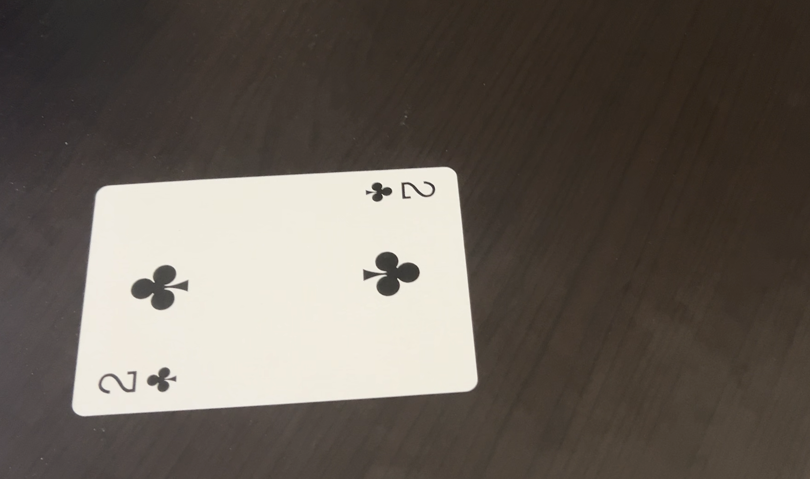

Crop With Bounding Boxes: 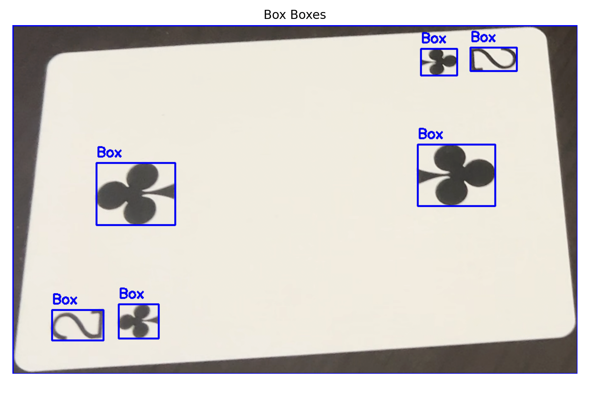

Middle value: 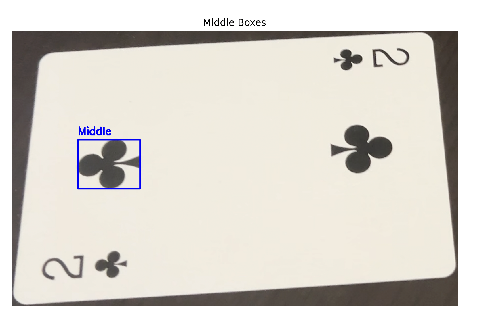

Suit value: 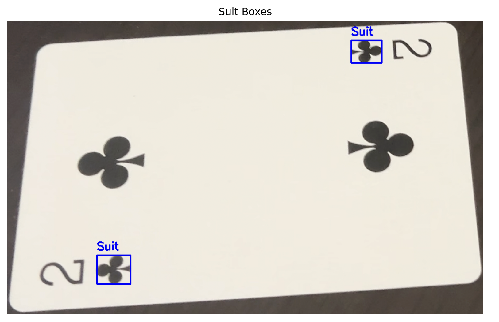

Card Value: 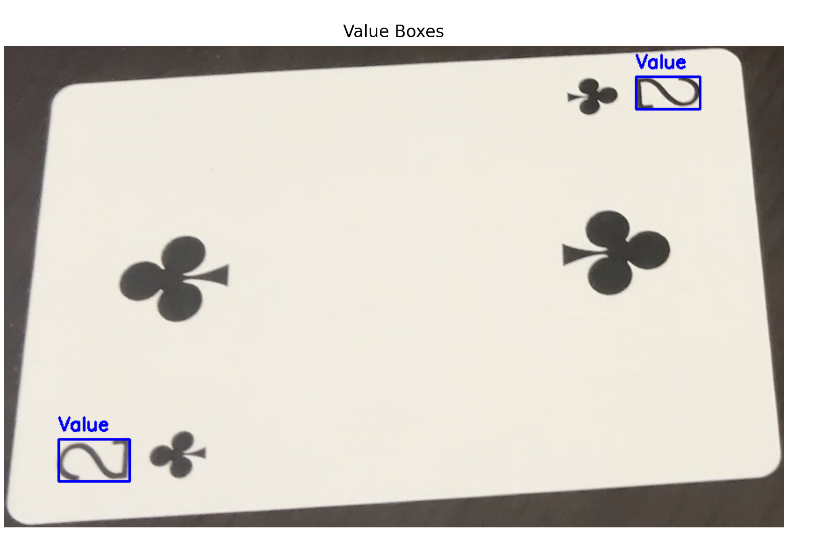

Prediction (recreated angles using live_card.py) : 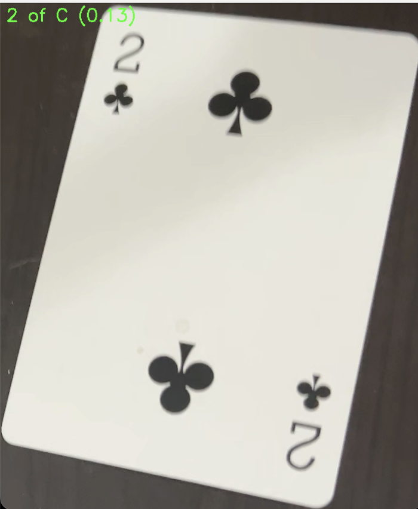

- Low confidence interval. Sometimes it would predict 3C.

## Part 4: Performance Metrics, Challenges, and Recommendations

Justification of the Choice of Classifier
The Single Shot Detector (SSD) was chosen for this project due to its efficiency, accuracy, and suitability for object detection tasks involving multi-class classification. SSD is a deep learning-based architecture designed to detect and classify objects within a single forward pass, making it computationally efficient and well-suited for real-time applications like playing card recognition. The architecture’s use of feature maps at different resolutions enables multi-scale object detection, which is crucial for accurately identifying objects of varying sizes, such as the values and suits on cards.
Another reason for selecting SSD is its strong transfer learning capability. With pretrained weights on a large-scale dataset like COCO, SSD provides a solid foundation that can be fine-tuned for domain-specific tasks, reducing the training data requirements and the associated computational overhead. Its ability to generalize across diverse input images makes it particularly useful for handling real-world challenges, such as varying lighting conditions, occlusions, and noisy inputs. Additionally, SSD’s balance of speed and accuracy makes it an optimal choice for object detection in scenarios where both high performance and efficiency are essential.
Classification Accuracy and Metrics.
The performance of the SSD model was evaluated using precision, recall, F1-score, and accuracy. The results indicate a precision of 6.44%, recall of 11.24%, F1-score of 7.56%, and an overall accuracy of 31.82%. While the accuracy may seem relatively higher, it is not necessarily reflective of true model performance, as it may be influenced by easier-to-detect classes or class imbalances within the dataset. Precision and recall, which directly assess the model's ability to make correct predictions and detect true positives, offer a clearer insight into its effectiveness. The F1-score, as a harmonic mean of precision and recall, provides a balanced metric that accounts for both false positives and false negatives.
These metrics were chosen over alternatives like ROC curves or AUC scores because precision, recall, and F1-score are more interpretable for multi-class object detection tasks. ROC curves are generally better suited for binary classification problems and can become less meaningful in the context of multi-class object detection, where class-specific performance is more relevant. Additionally, precision-recall trade-offs and their harmonic mean offer a more direct evaluation of the model's classification and detection quality, aligning better with the goals of this task.

## Observations and Challenges
The results reveal several challenges in the model's ability to detect and classify card features. The low precision indicates a high rate of false positives, while the low recall highlights the model's inability to detect many true positives. The disparity between these metrics and the overall accuracy suggests that certain classes may dominate the predictions, skewing the apparent performance. This issue is likely exacerbated by class imbalances in the dataset or insufficient fine-tuning of the pretrained model on domain-specific data. Furthermore, inconsistencies in label quality or bounding box annotations could contribute to the model's struggles in learning meaningful patterns.
Another challenge lies in the model's reliance on the COCO-pretrained weights, which may not transfer effectively to this specific domain without additional adjustments. The relatively poor performance across all metrics highlights the need for better alignment between the pretrained features and the nuances of playing card detection, such as recognizing small and intricate details like suits and values.
## Recommendations for Improvement
Several improvements can be implemented to enhance the model’s performance. Data augmentation techniques, such as random rotations, flips, and brightness adjustments, can increase the robustness of the model to variations in input images. Fine-tuning the SSD model by training the classification layers while freezing the backbone could better adapt the pretrained features to this specific task. Addressing class imbalances through oversampling underrepresented classes, applying class-weighted loss functions, or collecting more diverse training data can further improve generalization. Additionally, integrating Intersection over Union (IoU)-based evaluation metrics would provide a more detailed assessment of detection performance by considering the overlap between predicted and ground truth bounding boxes.
These steps, combined with careful dataset preprocessing and label quality assurance, will enhance the model's generalization capabilities. In the final testing phase, these adjustments are expected to yield a more reliable and accurate model for detecting and classifying playing card features.
## Individual Contributions
As the sole team member, I was responsible for all aspects of this project, including designing the model pipeline, implementing the SSD-based detection framework, preprocessing the dataset, and evaluating the results. I also identified challenges, proposed improvements, and documented the process in this report.
## Code and Instructions
The full implementation is available in the project repository. Instructions for running the code, along with a sample dataset and details on dependencies, are provided in the README.md file. This ensures reproducibility and allows for further experimentation and fine-tuning.
Python testing.py   | is the way to run this evaluation

### Part 3
NOTE: Git push origin main: did not let me push because of large files so this is uploaded through github.com, please contact if all the files aren’t there to run the code

**Methods**: 

**1. Preprocessing and Justification**
The python script SSDtesting.py contains 3 preprocessing methods, that are imported when training and testing:
  
- crop_card(image_path),
  
- classify_card_by_center(cropped_card_image, bounding_boxes),
  
- bounding(cropped_card_image, contour),
  
I will go into detail of each method, but what these 3 functions do is crop the card, bound boxes on the card (while removing noise and joining close bondings) and

- returns: {"Value": value_boxes,"Suit": suit_boxes,"Middle": middle_box, "Color": color, "Image (Crop)": cropped_card_image}
  
This is the original image:
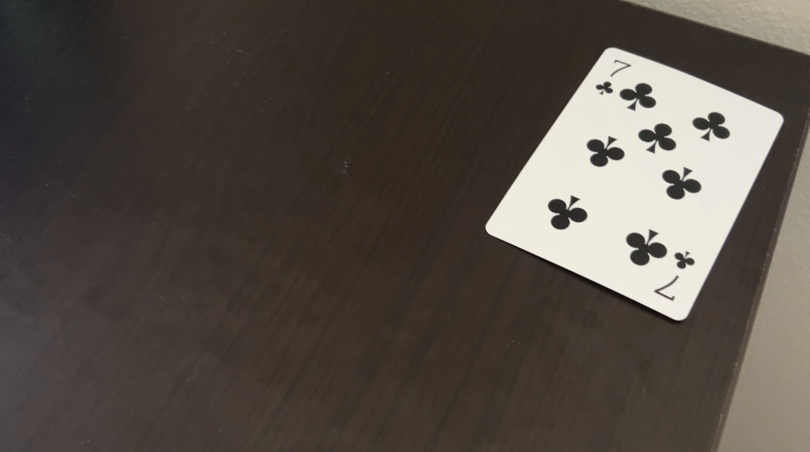
**Crop_Card(image_path):**
This function loads the image in grayscale which simplifies the edge detection on the table for our card. We then apply Gaussian blur to reduce noise ensuring edge detection isn’t influenced by small details. We then used Sobel for actual edge detection which was useful for identifying straight edges crucial for our horizontal and vertical gradients. After edge detection the image is thresholded to create a binary image (edges = white, non-edges = black). This step simplifies the edges, making it easier to detect contours and, ultimately, the card itself. We then findContours to identify the largest one (which will be the card), we use this largest contour to isolate the card itself from the image to crop and only focus on feature extraction from this card.Blurring is essential to smooth out noise, which could lead to false edges or small irrelevant contours. It ensures that the edge detection only highlights the meaningful boundaries. Tried to replicate what I learned from the cereal Sobel Operator: Sobel was a standard edge detection operator that computes intensity gradients, making it a suitable method for detecting the sharp, well-defined edges of a card. Sobel’s simple approach is ideal for detecting straight edges in relatively clean images. Thresholding: This is just the binary format we used in class so I continued from this baseline Contour Detection: Again is just the contour format we used in class so I continued from this baseline Bounding Box and Cropping: These are also basic methods learned from class just used cv_image show to display image, not even really sure if cropping can be more “efficient” 
**This is the cropped image:**
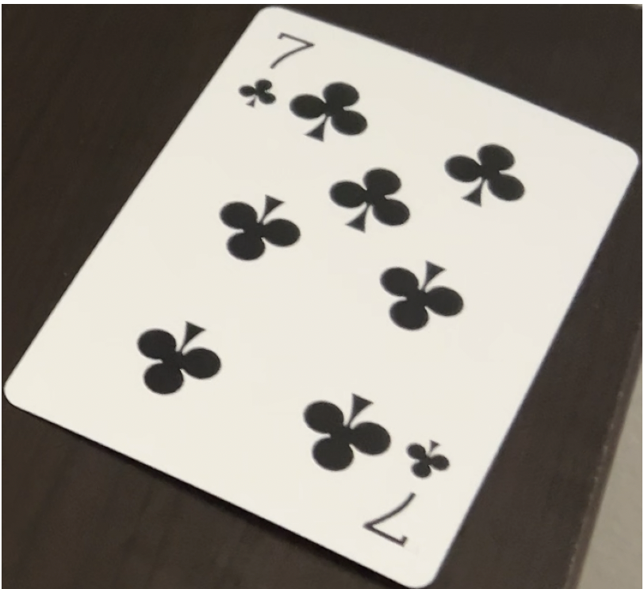

**Bounding(cropped_image, contour):**
This function is basically to clean up the card itself. We detect boxes, remove noise (of small irrelevant detections), merge boxes that are close together and display results. Parameters are a cropped_image and it returns a list of bounding boxes. We do the following steps to achieve this: grayscale conversion, image into grayscale -> convert image to binary based on intensity values, region labeling connection regions in the binary image, bounding box extraction with filtering of ones that are too small, then merge bounding boxes. The function isolates features by thresholding, labeling regions, and extracting bounding boxes. Nearby bounding boxes are merged to prevent misclassification of adjacent features. Not going to repeat with justifications of methods used above (grayscale conversion, thresholding, regional labeling). I will start from bounding boxes, extracts using properties = measure.regionprops(labels), I used this method because it was effective with the cereal and I was familiar with it using it to calculate stuff like area from properties which was helpful for merging based on overlapping pixels or removing if I think the object is too small. I merge objects nearby boxes to improving the accuracy of feature detection and reducing false positives. This is particularly useful when objects are close to each other but detected as separate regions.
**This is the object detection on card**
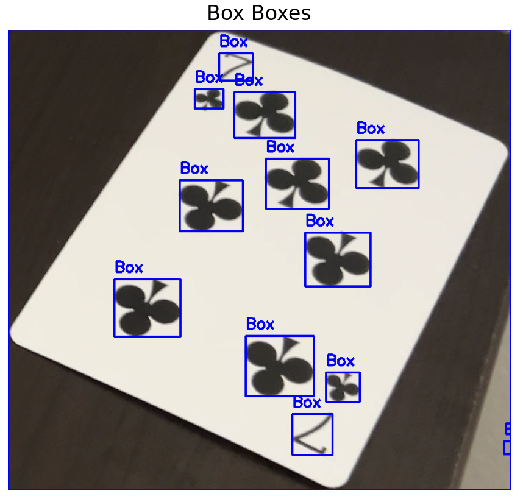

**classify_card_by_center(cropped_card_image, bounding_boxes):**

This method was the most interesting to code up. This method uses a combination of geometric, spatial, and color features to classify and segment card elements. By analyzing bounding boxes, measuring distances, and pairing related boxes, the algorithm is able to accurately extract key features like the card’s value and suit. Removing the Largest Bounding Box, This largest bounding box is the card itself so we no longer need this for identification of the card. Knowing the card itself is in the crop I find the center of the card. This center is found with image dimensions and then is used to measure relative distance of bounding boxes from this center (which I will explain why). We then use distance calculation between bounding boxes and card center to identify the boxes that are closest to center which is the middle of the card, then the furthest pair away from the center is the cards value and then next furthest is the cards suit as pictured below. There is a function to look for pairs, some problems I ran into was off the card detection furthest from middle so I made sure that when finding outer edges there is something equal distant and the opposite direction. I also implemented red or black detection on the middle object (since its uniformity center is the color). I then Return: The function returns a dictionary containing the bounding boxes for the value, suit, and middle features, the color detected, and the cropped image. This is the final output, useful for downstream tasks like classification or visualization.
**Here is the card boxes:**
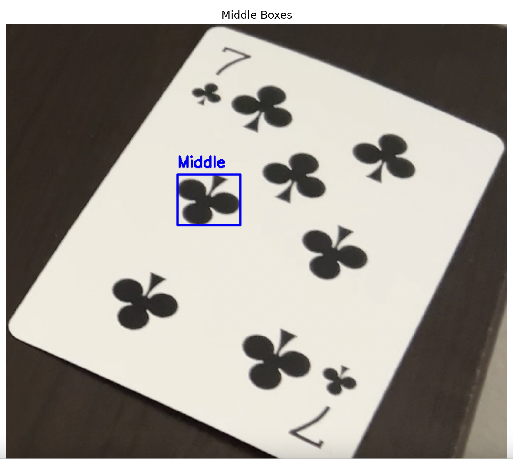

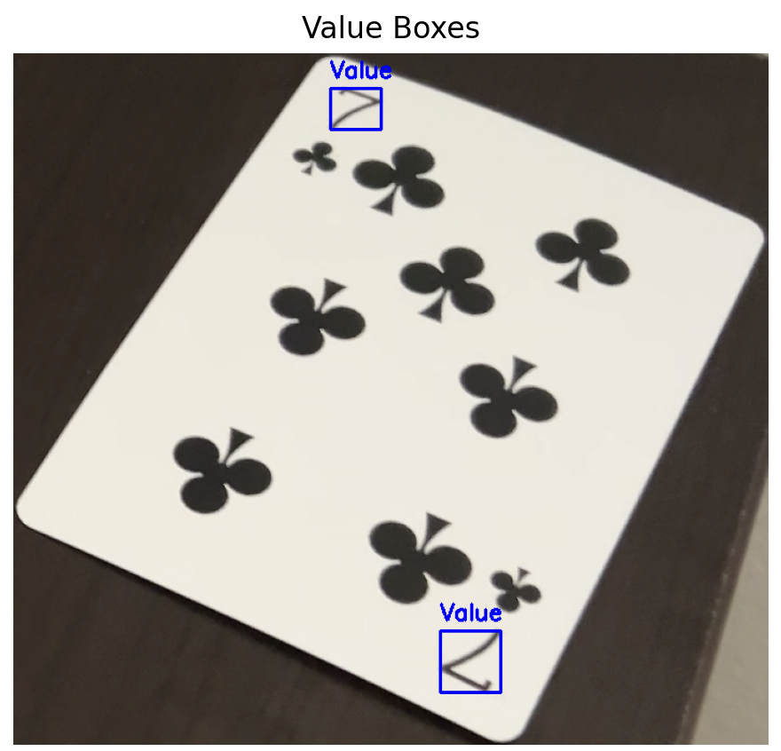

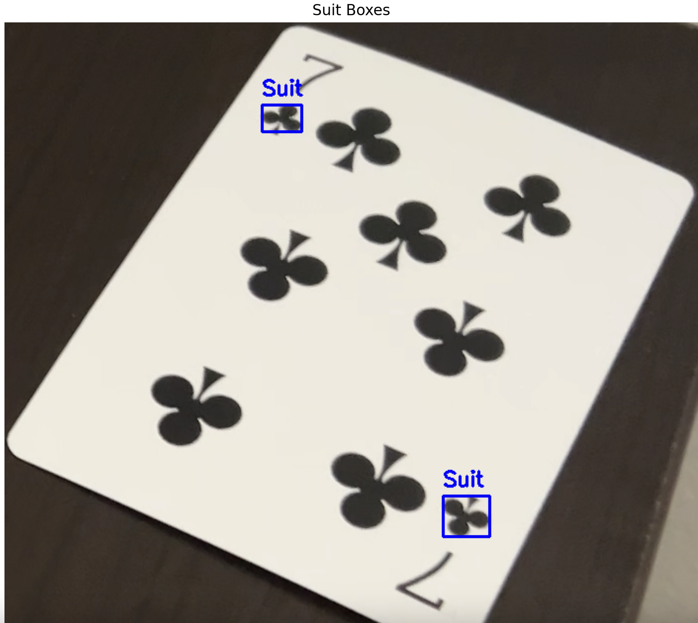

**Pre-Processing Limitations**
The current card processing model has limitations in its accuracy, typically achieving around 66% accuracy in correctly identifying the BOXES for value and suit of the cards. This is due to variability in card orientation and the complexity of distinguishing between closely placed symbols. While this approach works reasonably well, it doesn't always capture both the value and suit reliably. To improve the model's performance, the next update will focus on cropping the card image more precisely, rotating it to a straight alignment, and using a pixel prediction technique to fill in any gaps. This refinement is expected to enhance the accuracy of symbol detection and improve the overall card classification process. This limitation definitely affects my accuracy slightly because suit and values are getting mixed up, also sometimes it doesn’t always detect middle, suit and value all of them.

**Running the code**
 - Please run python testing_for_visuals.py to see the pre-processing breakdown and images.
   
 - SSDtraining.py is the same code just without visuals so I can use training and test data on our cards.
   
 - There is likely no need to run training.py but testing.py should work if you’d like to see the: Accuracy on test data: 31.8202, however around ⅓ each time

**Testing.py and Training.py**
Uses this: 
returns: {"Value": value_boxes,"Suit": suit_boxes,"Middle": middle_box, "Color": color, "Image (Crop)": cropped_card_image}

  As of right now I am still in the beginning stages of these codes but I will touch on them a little bit. Both use the same image processing of the 3 functions mentioned in feature extraction. of playing cards by first cropping the card from the original image. It then classifies card features (like value and suit) and extracts bounding boxes around them. The images are transformed and stored along with their corresponding bounding boxes and labels for use in a machine learning model. The machine learning model used is a pre-trained SSD (Single Shot MultiBox Detector) with a MobileNet V3 backbone, which is efficient for real-time object detection. SSD was chosen because it provides a good balance between speed and accuracy, making it ideal for detecting multiple objects like card values and suits in real-time. (SSD was recommended by professor for learning). Testing.py is just the reverse of training, same methods except using model for prediction

**Improvement Areas:** (These are mainly in feature extraction still but frameworks are here) 
- Implement better color detection to refine suit classification (e.g., distinguishing red vs black suits).
- Enhance the extraction of card values and suits for higher accuracy.
- Consider rotating and straightening the card images for more accurate bounding box detection.
- Added Joker and Backs of cards to the training, right now they are not identified by file names

## Part 2: Data Collection and Preparation

### 1. Source of Data
- **Collected Data**: The dataset consists of images of playing cards, captured manually using a phone camera. The images were taken under controlled indoor lighting conditions to ensure consistency across the dataset. Each card was photographed five times, resulting in a diverse dataset suitable for training, validation, and testing. I collected data using the camera.py script allowing me to take photos automatically speeding up the process and allowing 
  
  - The images are named in the format `XX-01.png`, where `XX` represents the card identifier (e.g., `KS` for King of Spades) and the number represents the sample.
  
### 2. Differences Between Training and Validation Subsets, these sets can be found in photos within each respective folder.
- **Training Set**: 60% (3) of the images were randomly selected for training. This set was collected with a fixed background, consistent lighting, and slight variations in positioning.
  
- **Validation Set**: 20% (1) of the images were used for validation. The validation images include minor variations in card angles, and slight changes in lighting or background, which helps evaluate the model's generalization.
  
- **Test Set (Unknown)**: 20% (1) of the images were set aside for final testing. These images will remain untouched until the final evaluation to avoid bias.

- These were chosen randomly in each resepctive folder using a script (card-dist.py) to speed up the process.

### 3. Number of Distinct Objects/Subjects
- The dataset contains **52 distinct card types** (e.g., King of Spades, Ace of Hearts, etc.). +2 different sets of Jokers and 5 of the back of the cards. Each card has **5 samples**, leading to a total of 275 images.

### 4. Characterization of Samples
- **Resolution**: The images are captured at a resolution of 1080x1920 pixels.
  
- **Sensors Used**: The images were captured using a smartphone camera (iPhone) with an automatic focus sensor.
  
- **Lighting and Ambient Conditions**: The dataset was collected under controlled indoor lighting, ensuring uniform exposure across the images. Variations

-End of Part2

# Poker Hand Identification Using Computer Vision
## Problem Overview
The goal of this project is to use computer vision to identify poker hands from images. This would involve detecting playing cards, then recognizing suits, ranks and value within the game and evaluating the hand based on the card combinations. Some challenges would include lighting, card orientation and different card designs. 
## Part 2: Approach
### Card Detection
The first step is to locate the playing cards within the image. Since cards are uniformly shaped rectangles, traditional object detection techniques such as edge detection or bounding boxes can be applied to find the card in the frame. 
### 2. Card Recognition
There are already concrete datasets of identifying playing cards for us from the website already provided. ​​http://www2.imse-cnm.csic.es/caviar/POKERDVS.html. The first part would be identifying traditional card designs, first the color, then suit, then rank. 
### 3. Poker Hand Evaluation
I think for this part we can use APIs to pull hand odds calculations. For specifically Texas Hold ‘Em depending on how many cards are shown we can even have pre flop odds, middle game odds and ending game odds to win. Then we could also give the cards on the board into either a library or API and give the classifier for pair, two pair, and more complex hands along with odds to win. 
##: Dataset Requirements
### 1. Training Dataset
The training data should have all playing cards. Maybe even some jokers to identify cards that maybe aren’t cards or maybe they're not being shown. Single cards would be used for classification and the backend will do hand calculations. We can have diverse conditions like angle for identifying cards, different lighting etc. The main concept is playing cards being the dataset but we might need additional data. 

### 2. Validation Dataset
We can have datasets of different playing cards that were not included in the training deck either to further prove our model with identifying stuff like suit and numbers or use to help tune and avoid overfitting. 
### 3. Testing Dataset
We will have certain cards not entered into the training dataset because if we can identify numbers and suit then we could get every card without all of them being in training. We can have different card variations, lighting and angles. 
##: Conclusion
This project will involve a complete computer vision pipeline to detect, recognize and evaluate poker hands. We will break the problem down into detection of cards, recognition of the actual value and then evaluation stages. I think given enough time and granted success I would like to implement the option of seeing which stage of the game we are in by seeing the amount of face down cards. Seeing 2 cards (your own hand) with 5 backs of cards is “preflop”, then “post flop” then “turn” then “river.” Challenges such as different card designs, lighting, angles will all come into effect. I think with enough training we can preserve. This is the high-level plan that outlines the direction for the project and we will adjust with new techniques throughout the semester. 

